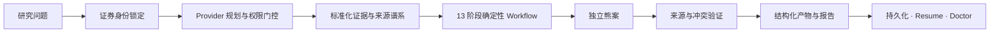

<div align="center">

# InvestKit

### 把一次 AI 回答，变成可复现、可恢复、可审计的投资研究工程

**An evidence-first investment-research AI Agent Harness.**

[](https://github.com/fezeryang/InvestKit/actions/workflows/ci.yml)
[](https://github.com/fezeryang/InvestKit/releases)
[](https://www.python.org/)
[](pyproject.toml)
[](LICENSE)
[](docs/product/roadmap.md)

[快速开始](#-5-分钟开始研究) · [能力与边界](#-当前能力) · [工作原理](#-为什么不是把-skills-粘在一起) · [研究样例](#-研究样例29-页-a-股创新板块报告) · [路线图](#-路线图)

</div>

---

InvestKit 是一个可安装的投资研究 **AI Agent Harness**：它将受治理的数据 Provider、版本化研究方法、固定工作流、证据谱系和持久化任务装进同一个本地执行内核，让 Codex 以及任何具备终端和 Python 3.11+ 的 AI 环境执行一致的研究过程。

它不是一组零散提示词，也不是把多个金融 Skills 的返回值拼成一篇文章。InvestKit 会先锁定证券身份，再规划已批准的数据源，把多源证据标准化为不可变快照，依次运行 13 个研究阶段，强制生成反方观点与来源核验，最后保存所有事实、假设、未知项、风险、日志和报告。

> [!IMPORTANT]
> InvestKit 是研究工具，不是交易机器人。它不连接券商、不下单、不转移或管理资金，不提供收益承诺。所有输出都需要人类研究者复核。

## ✨ 一眼看懂

| 你通常遇到的问题 | InvestKit 的处理方式 |
|---|---|
| 每次都要重新告诉 AI 分析标准 | 将投资标准、Skill 与 Workflow 版本化并随任务加载 |
| 多个数据源各说各话 | 先验证证券身份，再融合到统一 Provider 合约与证据快照 |
| 缺数据时模型“合理脑补” | 未知项沿工作流传播；证据不足时明确跳过，而不是补零或编造 |
| 报告看起来完整，却无法追溯 | 事实、估计、风险和结论绑定 `source_id`、日期与来源元数据 |
| 只有看多叙事 | 投资论点之后强制运行独立熊案和来源验证 |
| 对话中断后只能重来 | 任务、输入哈希、中间产物和运行日志落盘，可验证后恢复 |
| 第三方 Skill 自行联网或读取密钥 | 环境变量、Provider 审批、显式 `--allow-network` 与响应边界 |

## 🔬 研究样例：29 页 A 股创新板块报告

仓库包含一份可直接阅读的完整研究交付：

### [打开《A 股创新板块全景研究》PDF →](reports/market/a-share-innovation-2026-07-17/report.pdf)

- **29 页 A4 PDF**，包含 **20 张图表**；
- 研究范围为科创板、创业板、北交所行情节点返回的 **2,337 条有效行情观测**；
- 同时分析市场宽度、成交、估值、集中度、指数收益、波动与回撤；
- 明确区分事实、研究推断和未知项，并保留构建审计元数据；
- 数据截面声明为 `2026-07-17`。行情节点已完整分页，但未以交易所正式证券名录逐项证明“官方全量覆盖”。

这份报告展示了 InvestKit 想解决的问题：不是给出一句“热门赛道”，而是让数据范围、方法、限制和结论能够被检查。

## 🧭 当前能力

| 能力 | 当前状态 | 说明 |
|---|:---:|---|
| 证券身份识别 | ✅ | 先锁定交易所、代码与名称，拒绝 Provider 身份冲突 |
| 公司与商业模式研究 | ✅ | 驱动因素、KPI、竞争结构、风险与可证伪条件 |
| 财务与盈利质量 | ✅ | 基于已提供的标准化证据计算；保留期间和来源 |
| 相对估值与可比分析 | ✅ / 有条件 | 数据存在时运行；行业均值不能冒充同行样本 |
| 盈利、催化剂与事件分析 | ✅ / 有条件 | 只处理有日期、有来源的输入，缺失项保持未知 |
| 投资论点与独立熊案 | ✅ | 固定为两个独立阶段，随后进入来源验证 |
| 本地证据包研究 | ✅ | 支持合法取得、符合 Schema 的单一证券 JSON 包 |
| 获批 A 股代码研究 | ✅ / 有边界 | 显式联网许可下可使用已就绪的 SSE、广发和中金 Provider |
| 持久化、恢复与诊断 | ✅ | 不依赖聊天历史；`resume` 与只读 `doctor` 验证任务状态 |
| Codex 原生 Skill 投影 | ✅ | `investkit init` 安装受治理的一方 Skills |
| Claude Code / Cursor | CLI 兼容 | 可从项目终端调用同一 CLI；暂不宣称原生适配器完成 |
| 券商一致预期、可靠 DCF | 🚧 | 合约和首个分析切片在推进；尚无获批、稳定的完整实时数据链 |
| 量化、严谨回测、组合风控 | 🗺️ | 路线图能力，当前版本不宣称已经实现 |
| 交易执行 | 永不支持 | 永久边界：不连接券商、不下单、不管理资金 |

## 🧠 为什么不是“把 Skills 粘在一起”

单个 Skill 解决的是一次调用。Harness 负责的是调用前后的整个研究责任链：



| 层 | 作用 | 关键边界 |
|---|---|---|
| **Provider** | 获取或读取证据，并转换为统一操作 | Provider 不定义研究结论；联网和凭据必须显式授权 |
| **Evidence Contract** | 保存身份、日期、来源、数据与警告 | 无来源记录只能表达明确缺口，不能夹带正面事实 |
| **Investment Skills** | 执行版本化的专业研究方法 | 事实、假设、估计和未知项分别建模 |
| **Workflow** | 按固定依赖顺序编排研究 | 反方分析与来源验证不可被报告阶段绕过 |
| **Workspace** | 保存快照、阶段产物、日志和报告 | 恢复读取不可变快照，不静默读取后来修改的原文件 |
| **Diagnostics** | 检查安装、哈希、来源连接和任务完整性 | `doctor` 只读，发现问题但不擅自修复 |

进一步了解：[Harness 价值主张](docs/product/harness-value-proposition.md) · [产品架构](docs/product/architecture.md) · [研究数据合约](schemas/research-bundle-v1.schema.json)

## 🔁 固定的 13 阶段研究流程

```text
01 security-identification        证券身份识别
02 company-deep-research          公司深度研究
03 business-model-analysis        商业模式分析
04 financial-statement-analysis   财务报表分析
05 earnings-quality-analysis      盈利质量分析
06 valuation-analysis             估值分析
07 comps-analysis                 可比公司分析
08 earnings-analysis              盈利与预期分析
09 investment-thesis              可证伪投资论点
10 bear-case-analysis             独立熊案
11 catalyst-analysis              催化剂分析
12 source-verification            来源与冲突验证
13 investment-report              组装最终报告
```

每个阶段输出同一种结构化信封：`facts`、`assumptions`、`estimates`、`unknowns`、`findings`、`risks`、`warnings` 和 `source_ids`。无法满足输入要求的阶段会写出 `skip_reason` 与 `missing_inputs`，不会为了让报告“看起来完整”而制造数字。

## 🚀 5 分钟开始研究

### 1. 安装

需要 Python 3.11 或更高版本。推荐使用 `pipx` 隔离安装：

```bash
pipx install git+https://github.com/fezeryang/InvestKit.git
investkit --help
```

也可以从源码建立虚拟环境：

```bash
git clone https://github.com/fezeryang/InvestKit.git
cd InvestKit
python3 -m venv .venv
.venv/bin/python -m pip install --no-build-isolation --no-deps .
.venv/bin/investkit --help
```

### 2. 初始化研究空间

```bash
mkdir my-investment-research
cd my-investment-research
investkit init
chmod 600 .env
investkit doctor
```

以项目生成的 `.env.example` 为模板，只配置你有权使用的 Provider 凭据。不要把密钥写入仓库、命令参数、Prompt、Issue 或日志。

### 3. 研究一只获批范围内的 A 股

```bash
investkit research \
  --symbol 603868.SH \
  --question "分析公司的基本面、财务质量、行业相对估值、市场表现、催化剂与主要风险。" \
  --allow-network
```

`603868.SH` 是当前真实验收样例（飞科电器），不是荐股。Harness 会自动规划所有已配置且获批的 Provider。只有在分析师确认经营与会计口径确实可比时，才应额外传入 `--peer <证券代码>`。

### 4. 恢复与检查

```bash
investkit research --resume <research-task-id>
investkit doctor
```

研究结果位于 `workspace/research/<task-id>/`。报告只是最终视图；严肃复核时应同时检查证据快照、中间能力产物、来源、风险和运行日志。

## 📦 三种受治理的输入模式

### `symbol`：显式许可的在线研究

当前已实现的边界是：SSE 官方身份/公告元数据、广发 F10 与目标/行业相对估值、可选同行财务对比，以及中金行情、有限财务历史、资讯和异常交易证据。执行时必须同时满足 Provider 已批准、凭据可用和用户传入 `--allow-network`。

这条路径已经在 `603868.SH` 上做过边界内验收，但不代表所有证券、所有时点、所有字段均有机构级覆盖。

### `imported`：你提供的可审计证据包

```bash
investkit research \
  --input inputs/company.json \
  --question "这些证据支持怎样的财务耐久性判断、估值边界和主要风险？"
```

输入必须遵循封闭的 [`research-bundle-v1` Schema](schemas/research-bundle-v1.schema.json)。文件限定在初始化项目内、最大 2 MiB、UTF-8 普通 JSON；符号链接、目录逃逸、重复键、非有限数、未解析来源 ID 和疑似凭据内容会失败关闭。

仓库提供：

- [可填写的证据包模板](schemas/research-bundle-v1.template.json)
- [Microsoft FY2025 固定验收样例](fixtures/acceptance/microsoft-fy2025.json)

固定样例是历史财报证据，不包含当前价格、共识预期、WACC 或未来催化剂，因此不适合作为当前投资建议。

### `demo`：完全离线、确定性的体验路径

```bash
investkit demo research
```

Demo 使用虚构公司与固定数据，适合体验工作流、测试持久化和诊断，不代表真实证券研究。

## 🗂️ 一次研究留下什么

```text
workspace/research/<task-id>/
├── task.json                 # 任务、模式、证券与版本
├── question.md              # 原始研究问题
├── plan.json                # 固定 Workflow 计划
├── loaded-specs.json        # 本次加载的标准快照
├── installed-skills.json    # Skill 清单与版本
├── input/
│   └── research-bundle.json # 规范化的不可变输入快照
├── data/                     # Provider 操作记录
├── capabilities/            # 13 个阶段的结构化产物
├── sources.json             # 来源注册表
├── assumptions.json         # 显式假设
├── findings.json            # 研究发现
├── risks.json               # 风险与反方证据
├── run-log.json             # 可恢复运行日志
└── report.md                # 最终报告
```

输入会先规范化并记录 SHA-256。恢复任务时，InvestKit 验证已持久化状态并继续未完成阶段，而不是回到原始可变文件或依赖聊天上下文。

## 🛡️ 安全、证据与数据边界

- **密钥不入库：** Provider 凭据只放在权限为 `600` 的私有 `.env` 或进程环境变量中。
- **联网需许可：** 默认路径离线；在线研究必须显式传入 `--allow-network`。
- **第三方默认不可信：** 原始第三方包只进入本地隔离区，不随公开发行物分发，也不直接执行或安装。
- **来源先于叙事：** 重要事实必须能解析到来源注册表；缺失证据保持未知。
- **输入失败关闭：** 路径、Schema、日期、身份、数值和来源连接不满足合约时拒绝运行。
- **不做自动交易：** 研究可以讨论风险和情景，但永远不会提交订单或管理资金。

完整政策见 [Security Policy](docs/security/security-policy.md)。如发现安全问题，请避免在公开 Issue 中附带密钥、私有数据或未脱敏响应。

## 🌐 AI 平台与分发

GitHub 源码和 Release 是权威分发入口；Python wheel 与 `investkit` CLI 是唯一执行内核。平台集成调用同一个内核，不复制分析逻辑或凭据：

| 平台 | 当前使用方式 |
|---|---|
| **Codex** | 原生、已测试：初始化受治理的 `.agents/skills`，并调用 CLI 研究 |
| **Claude Code** | 从项目终端调用 CLI；原生适配器尚未宣称完成 |
| **Cursor** | 从项目终端调用 CLI；原生适配器尚未宣称完成 |
| **其他 AI 环境** | 当宿主允许项目终端且提供 Python 3.11+ 时，可调用同一 CLI |

更多信息见 [分发与平台支持](docs/product/distribution.md)。仓库贡献开发所用的编辑器状态不是 Runtime 适配器。

## 🗺️ 路线图

当前 `v0.3.0` 仍处于 Alpha。下一阶段首先补齐 **Decision Intelligence Core**，然后再扩展更广的研究能力：

1. 具备时点语义的行业比较、百分位和口径对齐；
2. 获批、可追溯的券商一致预期与预测修正；
3. 明确驱动因素与误差归因的盈利预测；
4. 有边界的 DCF / 反向 DCF、可比估值和情景价值区间；
5. 市场状态、量化研究、严谨回测、组合与风险、多资产、监控可靠性等独立能力包。

这些是路线图，不是当前版本的能力声明。完整的实现状态和发布门槛见 [Roadmap](docs/product/roadmap.md) 与 [Investment Capability Map](docs/product/investment-capability-map.md)。

## 🤝 参与贡献

欢迎通过 [Issues](https://github.com/fezeryang/InvestKit/issues) 提交：

- 可复现的缺陷与失败样例；
- 新 Provider 或数据合约提案；
- 研究方法、会计口径与证据边界改进；
- 文档、跨平台适配与安全审查建议。

提交 Provider 或第三方 Skill 前，请先说明来源、许可、所需网络端点、凭据、数据再分发限制和潜在遥测行为。不要提交 API Key、用户数据、券商账号或未经许可的专有数据。

## 📚 文档导航

| 文档 | 用途 |
|---|---|
| [产品需求](docs/product/PRD-v0.1.md) | 产品定义、原则、用户和验收边界 |
| [系统架构](docs/product/architecture.md) | 各层职责、数据合约和持久化模型 |
| [Harness 价值主张](docs/product/harness-value-proposition.md) | 为什么这不是直接调用 Skills |
| [分发策略](docs/product/distribution.md) | GitHub、CLI 与平台支持声明 |
| [能力地图](docs/product/investment-capability-map.md) | 已实现、部分实现和待实现能力 |
| [路线图](docs/product/roadmap.md) | 下一阶段排序和发布门槛 |
| [安全政策](docs/security/security-policy.md) | 密钥、网络、第三方代码与交易边界 |

## License

Licensed under the [Apache License 2.0](LICENSE).

---

<div align="center">

**Evidence before narrative · Unknowns before invention · Research before action**

InvestKit 的输出不构成个性化投资建议，也不保证任何投资结果。

</div>
